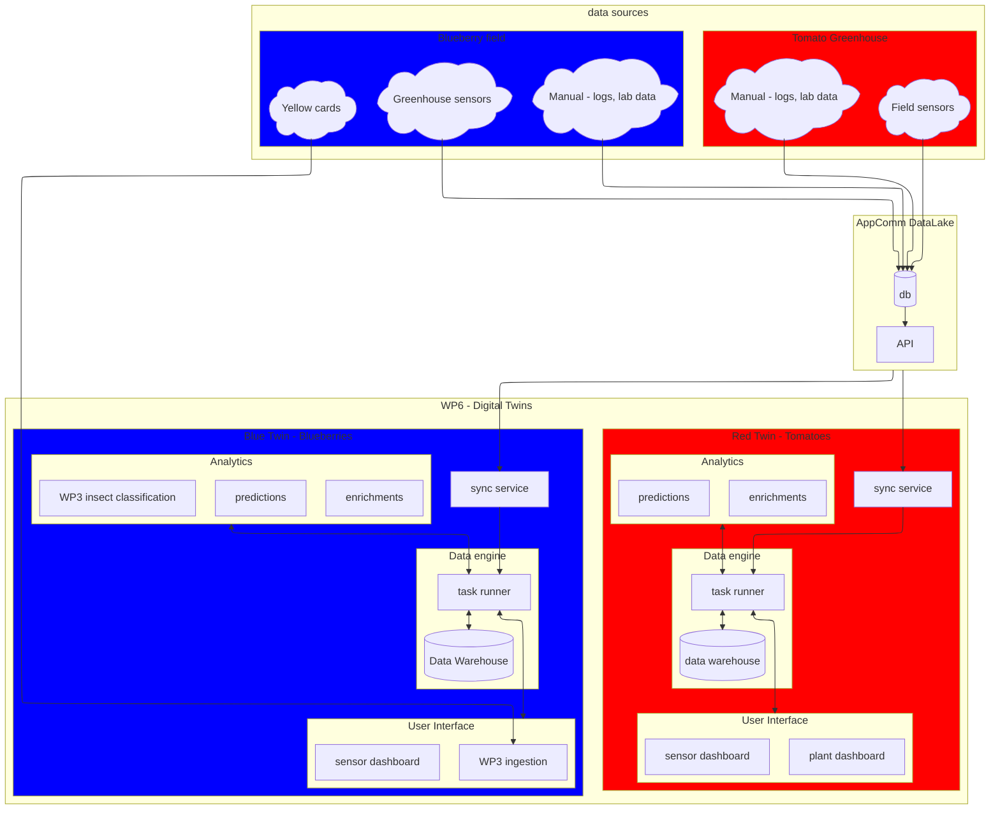

# WP6 Digital Twins in the context of SPoHF

## Data flows

Desired situation

## Descriptions

There are two digital twins.
On a high level, what they share:
- similar overall design
  - so that parts (code, infrastructre) can be reused
- the data formats
- the fact that there is (a lot of) data, that we visualize over time (basic dashboard)

In behavior they are different:
- different user interfaces
- different type of analysis
- and, obviously - different plants (lifecycle, needs), environments (field vs greenhouse)

### Blue Twin

The blue(berry) twin approach is as following:
Different fertilization strategies are used in a field where other variables (e.g. irrigation) are kept the same. from where chemical analysis shows which one works the best.
This of course is a slow feedback cycle.

Based on which works the best, the goal of the twin is to find the correlations in the sensor data with the best fertilization strategy, to see if there is a faster feedback cycle from the sensors.

This ultimately helps prescribing actions to take over the year to get a more desirable harvest.

these actions include: irrigation, adding nutrients, pest control

### Red Twin

The red twin (tomato) is as following:
As tomatoes grow in greenhouses, the climate is controlled at large scale.

A setup is being made for measuring at different heights:
- light (PAR)
- temperature
- humidity
- fruit thickness

From here we can visualize and model the microclimate around a single plant and its growth.

This ultimately prescribe actions that lead to reduced costs without impacting the harvest.

these actions may include: leaf maintenance, heat control, light control and positioning and water control.

## Operations

Where does what run:

- Fontys
    - user interfaces
    - temporary steps towards desired sitation, waiting for dependencies
- ProcEvolution
    - (everything else)
    - data warehouse
    - analytics services

<!-- ## Work distribution

For now, roughly:

- Nochschule Niederrhein
    - data analysis, finding correlations

- ProcEvolution
    - data engine
    - makes analysis and synchronization tools available within their platform

- Fontys
    - dashboards (monitoring, predictive and prescriptive twin), access
        - model specific for the new lighting setup in the RED twin
    - operationalize WP3
    - prediction models -->
