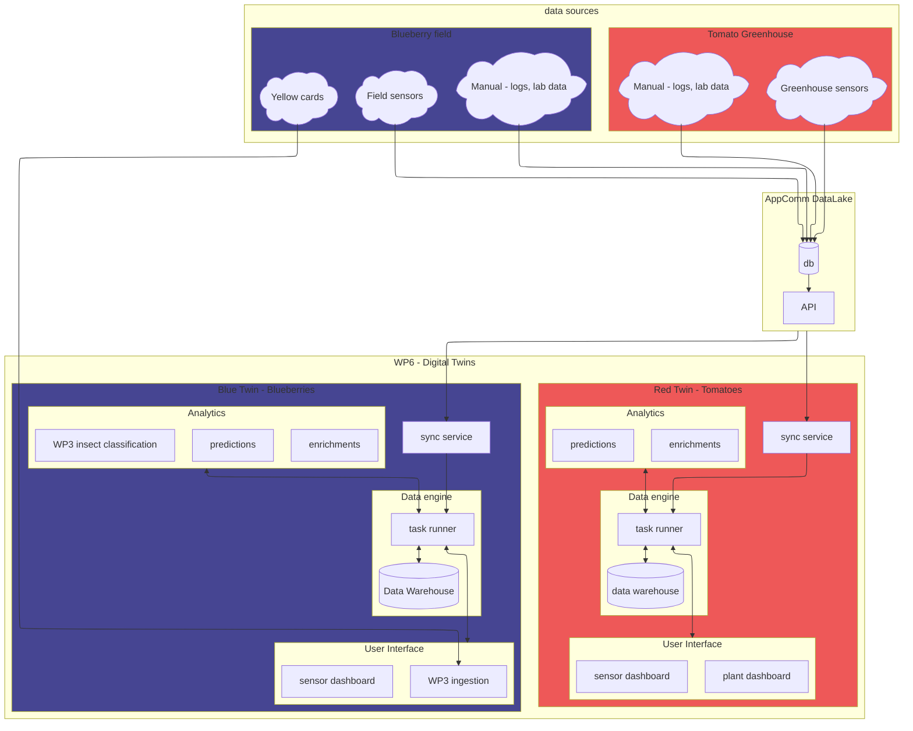

# WP6 Digital Twins in the context of SPoHF

## Data flows

Desired situation

## Operations

Where does what run:

- Fontys
    - user interfaces
    - potentially: schedulers and definitions of workloads
    - temporary steps towards desired sitation, waiting for dependencies
- ProcEvolution
    - data warehouse
    - task loads, e.g. syncronization
    - analytics services

<!-- ## Work distribution

For now, roughly:

- Hochschule Niederrhein
    - data analysis, finding correlations

- ProcEvolution
    - data engine
    - makes analysis and synchronization tools available within their platform

- Fontys
    - dashboards (monitoring, predictive and prescriptive twin), access
        - model specific for the new lighting setup in the RED twin
    - operationalize WP3
    - prediction models -->
