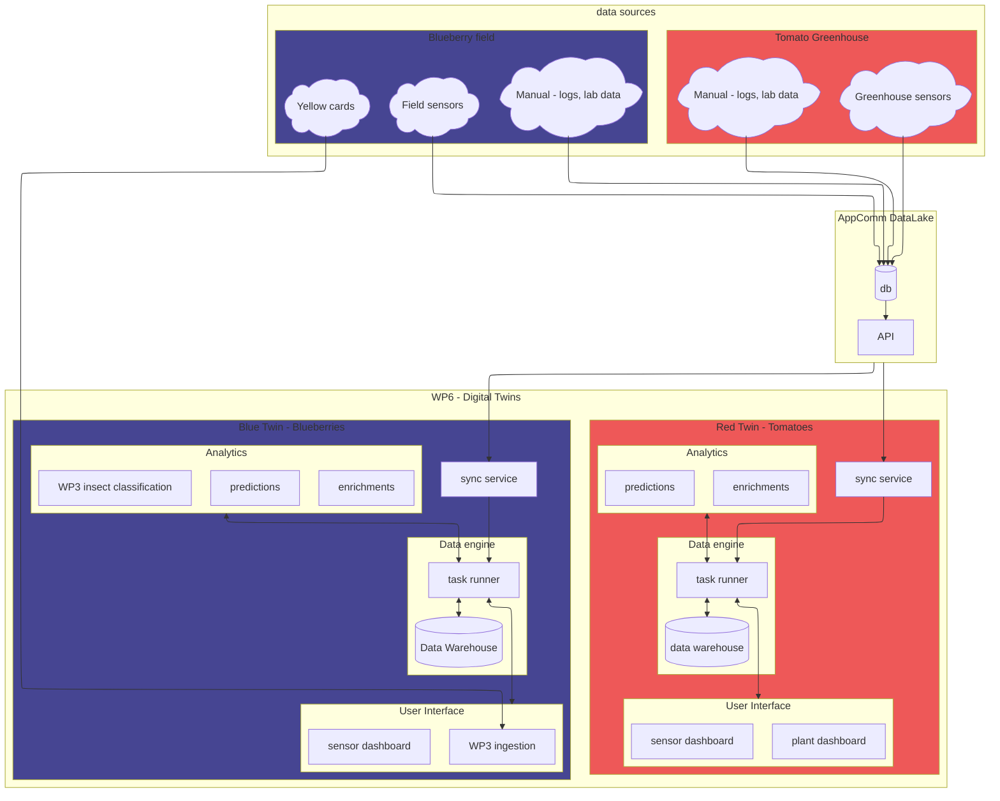
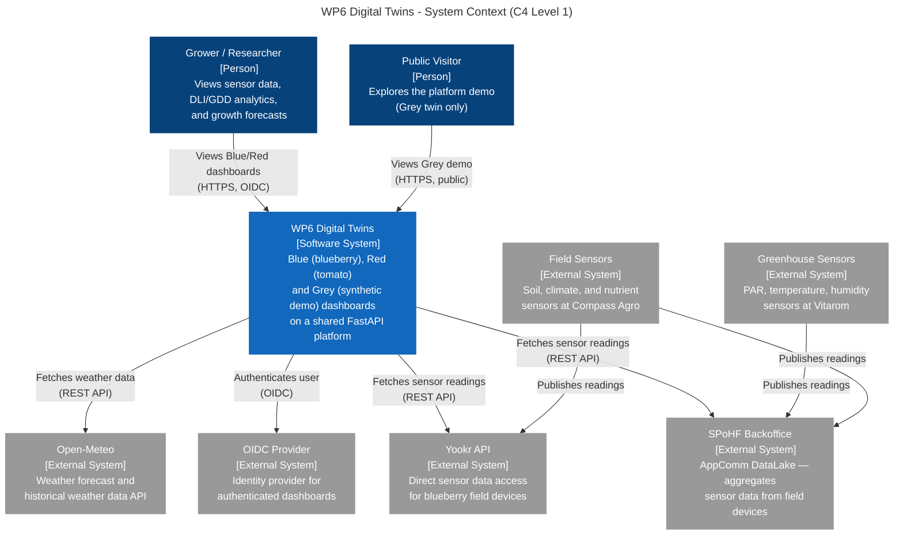

# WP6 Digital Twins in the context of SPoHF

## Data flows

Desired situation

## Operations

Where does what run:

- Fontys
    - user interfaces
    - potentially: schedulers and definitions of workloads
    - temporary steps towards desired sitation, waiting for dependencies
- ProcEvolution
    - data warehouse
    - task loads, e.g. syncronization
    - analytics services

## C4 architecture (current state)

The diagrams below describe the current implementation, reverse-engineered from
the codebase. They follow the [C4 model](https://c4model.com/): each level zooms
one step deeper, from the system in its environment down to the components inside
the codebase and how they're deployed.

The source files live in [`diagrams/`](diagrams/) and are validated by rendering
them with [`mmdc`](https://github.com/mermaid-js/mermaid-cli). Each `.mmd` file is
the single source of truth — the embedded copies below are kept in sync manually.

### System context (C4 L1)

How WP6 fits into its environment: who uses it and which external systems it
integrates with.

### Container view (C4 L2)

The deployable units — three dashboards (Blue, Red, Grey), the sync and export
CronJobs, and the data stores — and how they communicate. Note that DLI is part
of the Red dashboard process (not a separate container) and the shared platform
is shown as a library that every dashboard is built from.

```mermaid
---
title: "WP6 Digital Twins - Container Diagram (C4 Level 2)"
---
graph TB
    %% SSOT — also embedded in docs/architecture/index.md.
    %% Edit this file first, then mirror into index.md.
    classDef person fill:#08427b,color:#fff,stroke:none
    classDef container fill:#1168bd,color:#fff,stroke:none
    classDef database fill:#1168bd,color:#fff,stroke:none
    classDef external fill:#999,color:#fff,stroke:none
    classDef cronjob fill:#438dd5,color:#fff,stroke:none
    classDef shared fill:#0a3d62,color:#fff,stroke:none

    grower["Grower / Researcher
    [Person]"]:::person
    visitor["Public Visitor
    [Person]"]:::person

    subgraph wp6["WP6 Digital Twins"]
        direction TB

        subgraph platform["Shared Platform (wp6_data.shared)"]
            app_factory["App Factory
            [Library: FastAPI + Jinja2]
            Builds a dashboard from a
            TwinConfig (provider, theme,
            metadata, extra routers)"]:::shared
        end

        subgraph blue_twin["Blue Twin (Blueberries)"]
            blue_dash["Blue Dashboard
            [Container: FastAPI]
            Authenticated dashboard with
            chart compare, GDD tracker,
            and SPoHF / Yookr source toggle"]:::container
        end

        subgraph red_twin["Red Twin (Tomatoes)"]
            red_dash["Red Dashboard
            [Container: FastAPI]
            Authenticated dashboard with
            DLI analysis and ML forecasting
            (model trained on startup)"]:::container
        end

        subgraph grey_twin["Grey Twin (Demo)"]
            grey_dash["Grey Dashboard
            [Container: FastAPI]
            Public demo with synthetic
            in-memory sensor data —
            exercises the shared platform"]:::container
        end

        subgraph data_engine["Data Engine"]
            spohf_sync["SPoHF Sync Job
            [Container: Python CronJob]
            Windowed incremental sync
            every 15 minutes"]:::cronjob

            yookr_sync["Yookr Sync Job
            [Container: Python CronJob]
            Per-sensor monthly sync
            every 15 minutes"]:::cronjob

            blue_export["Blue CSV Export Job
            [Container: Python CronJob]
            Nightly export of Blue
            sensor data to CSV"]:::cronjob

            red_export["Red CSV Export Job
            [Container: Python CronJob]
            Nightly export of Red
            sensor tables to CSV"]:::cronjob
        end

        tsdb[("TimescaleDB
        [Database: PostgreSQL 17]
        readings, sync_metadata,
        daily_coverage hypertables")]:::database
    end

    mysqldb[("MySQL
    [External Database: MySQL 8]
    Fontys GreenTechLab —
    greenhouse sensor tables
    (Red twin only)")]:::external

    spohf["SPoHF Backoffice
    [External: REST API]"]:::external
    yookr["Yookr API
    [External: REST API]"]:::external
    openmeteo["Open-Meteo
    [External: REST API]"]:::external
    oidc["OIDC Provider
    [External: HTTPS]"]:::external

    %% User flows
    grower -->|"HTTPS\n(OIDC)"| blue_dash
    grower -->|"HTTPS\n(OIDC)"| red_dash
    visitor -->|"HTTPS\n(public)"| grey_dash

    %% Auth flow
    blue_dash -.->|"OIDC"| oidc
    red_dash -.->|"OIDC"| oidc

    %% Platform composition (each dashboard IS a configured app_factory)
    blue_dash -.->|"built from"| app_factory
    red_dash -.->|"built from"| app_factory
    grey_dash -.->|"built from"| app_factory

    %% Data access
    blue_dash -->|"Async queries\n(psycopg3 pool)\nproject filter:\nspohf-datalake | yookr-direct"| tsdb
    red_dash -->|"Async queries\n(aiomysql)"| mysqldb
    red_dash -->|"Daily forecast\n(HTTPS)"| openmeteo
    %% grey_dash has no datastore (in-memory)

    %% Sync jobs
    spohf_sync -->|"Paginated fetch\n(httpx)"| spohf
    spohf_sync -->|"Batch upsert"| tsdb

    yookr_sync -->|"Per-sensor fetch\n(httpx)"| yookr
    yookr_sync -->|"Batch upsert"| tsdb

    %% Export jobs
    blue_export -->|"Read readings"| tsdb
    red_export -->|"Read sensor tables"| mysqldb
```

### Component view (C4 L3)

Inside the codebase. The shared platform (`wp6_data.shared`) defines a
`SensorDataProvider` Protocol; each twin (`wp6_data.blue`, `wp6_data.red`,
`wp6_data.grey`) provides an implementation plus a `TwinConfig`, and
`create_app(config)` assembles the FastAPI dashboard. Twin-specific features
(DLI for Red, GDD for Blue) attach as `extra_routers`.

```mermaid
---
title: "WP6 Digital Twins - Component Diagram (C4 Level 3)"
---
graph TB
    %% SSOT — also embedded in docs/architecture/index.md.
    %% Edit this file first, then mirror into index.md.
    classDef component fill:#438dd5,color:#fff,stroke:none
    classDef platform fill:#0a3d62,color:#fff,stroke:none
    classDef protocol fill:#8e44ad,color:#fff,stroke:none
    classDef database fill:#1168bd,color:#fff,stroke:none
    classDef external fill:#999,color:#fff,stroke:none

    %% ── External systems ──
    spohf_api["SPoHF REST API
    [External]"]:::external
    yookr_api["Yookr REST API
    [External]"]:::external
    openmeteo_api["Open-Meteo API
    [External]"]:::external
    oidc_provider["OIDC Provider
    [External]"]:::external
    tsdb[("TimescaleDB
    readings | sync_metadata
    daily_coverage")]:::database
    mysqldb[("MySQL
    GTL sensor tables
    (Red only)")]:::database

    %% ────────────────────────────────────────────────
    %% Shared Platform — the heart of the application
    %% ────────────────────────────────────────────────
    subgraph platform["Shared Platform (wp6_data.shared)"]
        app_factory["create_app
        [Component]
        Builds FastAPI app from
        TwinConfig: routes, auth,
        provider dispatch, lifespan"]:::platform

        twin_config["TwinConfig
        [Dataclass]
        twin_id, title, theme,
        data_sources, metadata,
        extra_routers, hero_cards"]:::platform

        provider_protocol["SensorDataProvider
        [Protocol]
        fetch_data, fetch_available_sensors,
        fetch_device_data, fetch_sync_metrics,
        fetch_daily_coverage"]:::protocol

        shared_routes["Shared Routes
        [Component]
        home | charts | dashboard_page
        status | api | health"]:::platform

        auth_mod["Auth (OIDC)
        [Component]
        startup_oidc, make_auth_router,
        verify_session_user"]:::platform

        metadata_mod["MetadataRegistry
        [Component]
        Loads metadata.yaml:
        device + sensor labels, units"]:::platform

        misc_shared["templates | aggregation
        charts | export | time
        sensor_summary | twin
        [Components]"]:::platform
    end

    %% ────────────────────────────────────────────────
    %% Blue Twin
    %% ────────────────────────────────────────────────
    subgraph blue_layer["Blue Twin (wp6_data.blue)"]
        blue_config["dashboard.config
        [TwinConfig instance]
        2 DataSources: spohf-datalake
        and yookr-direct"]:::component
        blue_provider["BlueSensorProvider
        [Component, x2]
        TSDB-backed, project-filtered
        (one per DataSource)"]:::component
        blue_deps["deps
        [Component]
        TSDB queries, fetch_data,
        fetch_sync_metrics, …"]:::component
        blue_routes_x["Blue Extra Routes
        [Components]
        ops | charts | gdd"]:::component
        blue_gdd["gdd
        [Component]
        Growing Degree Days
        cumulative heat tracker"]:::component
        blue_metadata[("blue/metadata.yaml")]:::component
    end

    %% ────────────────────────────────────────────────
    %% Red Twin
    %% ────────────────────────────────────────────────
    subgraph red_layer["Red Twin (wp6_data.red)"]
        red_config["dashboard.config
        [TwinConfig instance]
        1 DataSource: mysql"]:::component
        red_provider["RedSensorProvider
        [Component]
        MySQL-backed sensor access"]:::component
        red_db["MySQLConnection
        [Component]
        aiomysql pool with
        sensor type mapping"]:::component
        red_routes_x["Red Extra Routes
        [Components]
        browse | dli | dli_model | charts"]:::component
        red_metadata[("red/metadata.yaml")]:::component

        subgraph dli_layer["DLI sub-package (red.dli)"]
            dli_model["LightModel
            [Component]
            Two-stage Ridge regression
            persisted to .pkl"]:::component
            dli_calc["Calculator
            [Component]
            PAR→DLI conversion,
            lamp contribution"]:::component
            dli_weather["WeatherClient
            [Component]
            Open-Meteo daily forecasts
            with caching"]:::component
            dli_agg["Aggregation
            [Component]
            Daily features,
            cyclic day-of-year"]:::component
        end
    end

    %% ────────────────────────────────────────────────
    %% Grey Twin (demo / platform smoke test)
    %% ────────────────────────────────────────────────
    subgraph grey_layer["Grey Twin (wp6_data.grey)"]
        grey_config["dashboard.config
        [TwinConfig instance]
        require_auth=False,
        in-memory data source"]:::component
        grey_provider["GreySensorProvider
        [Component]
        Sine-wave synthetic data,
        no DB"]:::component
        grey_metadata[("grey/metadata.yaml")]:::component
    end

    %% ────────────────────────────────────────────────
    %% Sync layer (independent CronJob processes)
    %% ────────────────────────────────────────────────
    subgraph sync_layer["Sync Orchestration (wp6_data.sync)"]
        spohf_orch["SyncOrchestrator
        [Component]
        Windowed sync with
        early-stop on duplicates"]:::component
        yookr_orch["YookrSyncOrchestrator
        [Component]
        Per-sensor ingestion
        via SensorRegistry (CSV)"]:::component
    end

    %% ────────────────────────────────────────────────
    %% API client + DB layers
    %% ────────────────────────────────────────────────
    subgraph api_layer["API Clients (wp6_data.api, wp6_data.yookr)"]
        spohf_client["SpoHFClient
        [Component]
        Paginated async fetcher
        with timestamp windowing"]:::component
        yookr_client["YookrClient
        [Component]
        Session auth, per-sensor
        monthly-windowed fetcher"]:::component
    end

    subgraph db_layer["Database Layer (wp6_data.db)"]
        pool["ConnectionPool
        [Component]
        Async psycopg3 pool
        (singleton, lazy init)"]:::component
        queries["Queries
        [Component]
        upsert_readings,
        upsert_daily_coverage"]:::component
        schema["Schema
        [Component]
        Idempotent DDL:
        hypertables + indexes"]:::component
    end

    config["Settings (Pydantic)
    [Component]
    WP6_* env vars for all
    connections and behavior"]:::component

    %% ────────────────────────────────────────────────
    %% Connections — platform composition
    %% ────────────────────────────────────────────────
    twin_config -->|"data_sources[*].provider"| provider_protocol
    app_factory -->|"reads"| twin_config
    app_factory -->|"mounts"| shared_routes
    app_factory -->|"wires"| auth_mod
    app_factory -->|"loads"| metadata_mod
    shared_routes -->|"depends on"| provider_protocol
    auth_mod -->|"OIDC flow"| oidc_provider
    misc_shared -.->|"used by"| shared_routes

    %% Per-twin: each is a TwinConfig + provider implementing the protocol
    blue_config -->|"built by"| app_factory
    red_config -->|"built by"| app_factory
    grey_config -->|"built by"| app_factory

    blue_provider -.->|"implements"| provider_protocol
    red_provider -.->|"implements"| provider_protocol
    grey_provider -.->|"implements"| provider_protocol

    blue_config -->|"data_sources"| blue_provider
    blue_config -->|"extra_routers"| blue_routes_x
    blue_config -->|"metadata"| blue_metadata
    blue_provider --> blue_deps
    blue_routes_x --> blue_gdd
    blue_routes_x --> blue_deps

    red_config -->|"data_sources"| red_provider
    red_config -->|"extra_routers"| red_routes_x
    red_config -->|"metadata"| red_metadata
    red_provider --> red_db
    red_routes_x --> dli_model
    red_routes_x --> red_db
    dli_model --> dli_calc
    dli_model --> dli_weather
    dli_model --> dli_agg
    dli_weather -->|"Daily weather"| openmeteo_api

    grey_config -->|"data_sources"| grey_provider
    grey_config -->|"metadata"| grey_metadata

    %% Data layer
    blue_deps --> pool
    pool --> tsdb
    schema --> pool
    red_db --> mysqldb

    %% Sync (separate processes — not the dashboards)
    spohf_orch --> spohf_client
    spohf_orch --> queries
    yookr_orch --> yookr_client
    yookr_orch --> queries
    queries --> pool
    spohf_client -->|"GET /api/v1/data"| spohf_api
    yookr_client -->|"POST /login\nGET /sensor/read"| yookr_api

    %% Config flows everywhere
    config -.->|"configures"| spohf_orch
    config -.->|"configures"| yookr_orch
    config -.->|"configures"| pool
    config -.->|"configures"| blue_config
    config -.->|"configures"| red_config
```

### Deployment view

Kubernetes topology across the two clusters (Fontys for user-facing dashboards,
ProcEvolution for the data warehouse and sync jobs), the external Fontys GTL
MySQL, and how secrets are split between clusters.

```mermaid
---
title: "WP6 Digital Twins - Deployment Diagram"
---
graph TB
    %% SSOT — also embedded in docs/architecture/index.md.
    %% Edit this file first, then mirror into index.md.
    classDef k8s fill:#326ce5,color:#fff,stroke:none
    classDef pod fill:#438dd5,color:#fff,stroke:none
    classDef storage fill:#1168bd,color:#fff,stroke:none
    classDef ingress fill:#08427b,color:#fff,stroke:none
    classDef external fill:#999,color:#fff,stroke:none
    classDef cronjob fill:#6b9ed6,color:#fff,stroke:none

    %% ── External actors and services ──
    user["Grower / Researcher
    [Browser]"]:::external
    visitor["Public Visitor
    [Browser]"]:::external
    spohf_ext["backoffice.spohf.com"]:::external
    yookr_ext["api.yookr.org"]:::external
    openmeteo_ext["api.open-meteo.com"]:::external
    oidc_ext["OIDC Provider"]:::external
    mysql_ext[("Fontys GTL MySQL 8
    [External Managed DB]
    Greenhouse sensor tables")]:::external

    %% ── Fontys cluster — user-facing dashboards ──
    subgraph fontys["Fontys Kubernetes Cluster"]
        direction TB

        blue_ingress["Ingress
        wp6-blue.spohf.fontysvenlo.dev"]:::ingress
        red_ingress["Ingress
        wp6-red.spohf.fontysvenlo.dev"]:::ingress
        grey_ingress["Ingress
        wp6-grey.spohf.fontysvenlo.dev"]:::ingress

        blue_deploy["Blue Dashboard
        [Deployment: 1 replica]
        FastAPI + Uvicorn"]:::pod
        red_deploy["Red Dashboard
        [Deployment: 1 replica]
        FastAPI + Uvicorn"]:::pod
        grey_deploy["Grey Dashboard
        [Deployment: 1 replica]
        FastAPI + Uvicorn
        (no DB, no auth)"]:::pod

        blue_export_cron["Blue CSV Export
        [CronJob: 0 2 * * *]
        Nightly Blue export"]:::cronjob
        red_export_cron["Red CSV Export
        [CronJob: 0 2 * * *]
        Nightly Red sensor export"]:::cronjob

        fontys_secrets["Kubernetes Secret
        OIDC client/session,
        TSDB URL, MySQL creds"]:::k8s
    end

    %% ── ProcEvolution cluster — data warehouse + sync ──
    subgraph procevo["ProcEvolution Kubernetes Cluster"]
        direction TB

        tsdb_sts["TimescaleDB
        [StatefulSet: 1 replica]
        PostgreSQL 17 +
        TimescaleDB extension"]:::storage

        tsdb_pvc[("PersistentVolumeClaim
        timescaledb-data")]:::storage

        spohf_cron["SPoHF Sync
        [CronJob: */15 * * * *]
        Incremental windowed sync"]:::cronjob

        yookr_cron["Yookr Sync
        [CronJob: */15 * * * *]
        Per-sensor monthly sync"]:::cronjob

        procevo_secrets["Kubernetes Secret
        SPoHF/Yookr API tokens,
        TSDB credentials"]:::k8s
    end

    %% ── User → Ingress → Deployment ──
    user -->|"HTTPS"| blue_ingress
    user -->|"HTTPS"| red_ingress
    visitor -->|"HTTPS"| grey_ingress
    blue_ingress --> blue_deploy
    red_ingress --> red_deploy
    grey_ingress --> grey_deploy

    %% ── Auth ──
    blue_deploy -.->|"OIDC"| oidc_ext
    red_deploy -.->|"OIDC"| oidc_ext

    %% ── Cross-cluster + external data access ──
    blue_deploy -->|"psycopg3\nport 5432"| tsdb_sts
    blue_export_cron -->|"port 5432"| tsdb_sts
    red_deploy -->|"aiomysql\nport 3306"| mysql_ext
    red_export_cron -->|"port 3306"| mysql_ext
    red_deploy -->|"HTTPS"| openmeteo_ext

    %% ── Storage ──
    tsdb_sts --- tsdb_pvc

    %% ── Sync jobs ──
    spohf_cron -->|"HTTPS"| spohf_ext
    spohf_cron -->|"port 5432"| tsdb_sts
    yookr_cron -->|"HTTPS"| yookr_ext
    yookr_cron -->|"port 5432"| tsdb_sts

    %% ── Secret mounts ──
    fontys_secrets -.->|"mounted"| blue_deploy
    fontys_secrets -.->|"mounted"| red_deploy
    fontys_secrets -.->|"mounted"| blue_export_cron
    fontys_secrets -.->|"mounted"| red_export_cron
    procevo_secrets -.->|"mounted"| spohf_cron
    procevo_secrets -.->|"mounted"| yookr_cron
    %% grey_deploy needs no secrets — it's stateless and public
```

<!-- ## Work distribution

For now, roughly:

- Hochschule Niederrhein
    - data analysis, finding correlations

- ProcEvolution
    - data engine
    - makes analysis and synchronization tools available within their platform

- Fontys
    - dashboards (monitoring, predictive and prescriptive twin), access
        - model specific for the new lighting setup in the RED twin
    - operationalize WP3
    - prediction models -->
