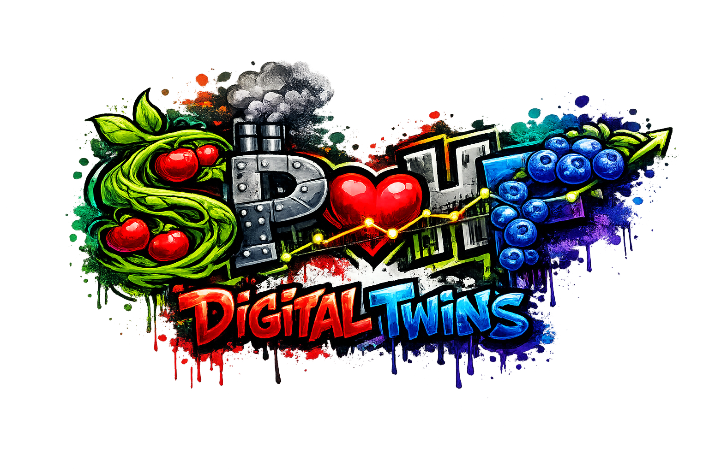
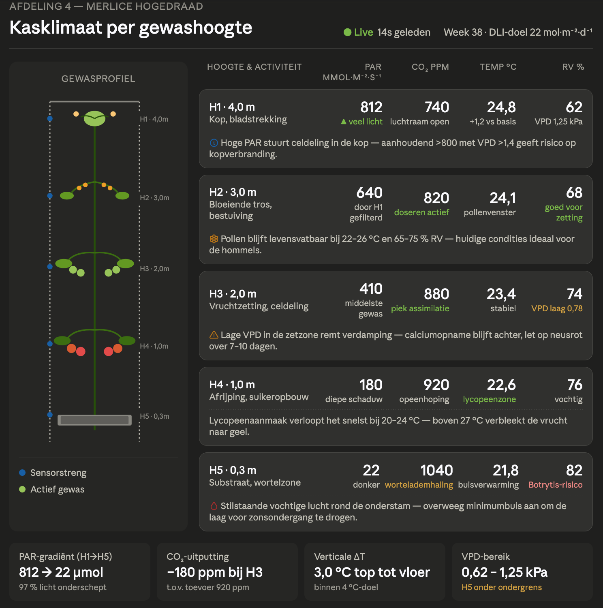
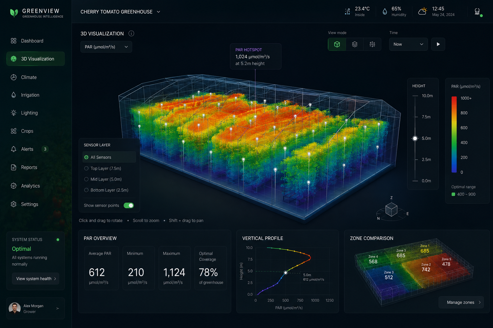

# Welcome

To the home of WP6 - Digital twin. A workpackage within
[SPoHF (Sustainable Production of Healthy Food)](https://www.spohf.com/).

*image generated with chatGPT*

📋 **[View the monthly changelog](changelog/index.md)** — new functionality delivered each month.

## The twins

The 'digital twin' is a concept used in different contexts, lets make them more explicit:
- The digital twin, as part the work package (WP6) in SPoHF. Which involves research, data analysis and delivering 'the twin'.
- The digital twin as a platform, which is the reusable infrastructure and functionality that we are building in WP6, to be used for the twins but also for other use cases in the future. This is demonstrated in the 'grey' twin - a public demo with fake data, to show dashboarding capabilities of the platform.
- The specific digital twins, which built on top of the platform, with specific features to support use cases and findings from the blueberry and tomato domains. Due to the color of the fruits, we call them the 'blue' and 'red' twin respectively.

| Dashboard | Status | Reason/remark | Data source | URL |
|-----------|--------| -------|---------|-----|
| **Blue** |🟢 Ready for use | Yookr API | Synced from Yookr API (AppComm) | [wp6-blue.spohf.fontysvenlo.dev](https://wp6-blue.spohf.fontysvenlo.dev) |
| **Red** | 🟢 Ready for use | Temporary data source (data from october 2025) | Fontys GreenTechLab database | [wp6-red.spohf.fontysvenlo.dev](https://wp6-red.spohf.fontysvenlo.dev) |
| **Grey** | 🟡 Public demo only | Demonstrating generic platform capabilities (public)  | Fake data | [wp6-grey.spohf.fontysvenlo.dev](https://wp6-grey.spohf.fontysvenlo.dev) |

## Red and Blue twins

In behavior they are different, due to different data, models, needs and usage.

### Blue Twin

The research on blueberries performed by our partner Compass Agro is more scientific-based. It is an experimental approach, where different fertilization strategies are applied in the field, and the results are analyzed chemically to see which one works best.
Therefore, the data is being analyzed to find correlations between the sensor data, manual measurements and actions together with the fertilization strategy.
Blueberries are perenial plants and the harvest is once a year, so the feedback cycle is very long, and the twin can help in prescribing actions to take over the year to get a more desirable harvest. These actions include irrigation, adding nutrients, and pest control.

The product features provides are therefore more focused on supporting the research and analysis, rather than being a 'ready to use' product for farmers or other users. Analysis happens on historical data, to find correlations and insights.

### Blue features

- **GDD** - A specific feature we've built for investigating is the Growing Degree Days (GDD), which is a measure of heat accumulation used to predict plant development stages. By analyzing the GDD in relation to the fertilization strategies and other factors, we can gain insights into how to optimize the growth and yield of the blueberries. But also discover undocumented data on the specific cultivar used in the field.
- **Insect Data** - The Twin ingests the automated insect counts from pictures of yellow cards in the fields (from work package 3).

Pending work:
- Analysis results of 2026

## Red Twin

- **DLI prediction model** - (on hold) With the sensor data and weather predictions, we built a model to predict the Daily Light Integral (DLI) in the greenhouse, which is a measure of the total amount of photosynthetically active radiation (PAR) received by the plants in a day. This can help in optimizing costs and light conditions for the tomatoes, especially in winter when artificial lighting is used.

- **Multi-height** - (current focus) In WP1&WP2 a multi-height sensor setup is being implemented in the greenhouse, to measure the microclimate around the plants at different heights. We are investigating developing different views for this (driven by the needs of the users):
  - **Detailed views** with _prescriptive_ insight around the microclimate, to support actions on the different growth stages of the plants, including leaf maintenance, heat control, light control and positioning and water control.
   (AI-generated prototype)

  - **3D visualization** of the microclimates in the entire greenhouse, incorporating multiple multi-height setups
   (AI-generated prototype)

  - **Time-lapse** visualization of the microclimate around a single plant, to see how it changes over time and in response to actions taken.

## Architecture

see [architecture](architecture/index.md)

## Code repository

github [SPoHF-WP6-Twins repository](https://github.com/SPoHF/SPoHF-WP6-Twins/)
